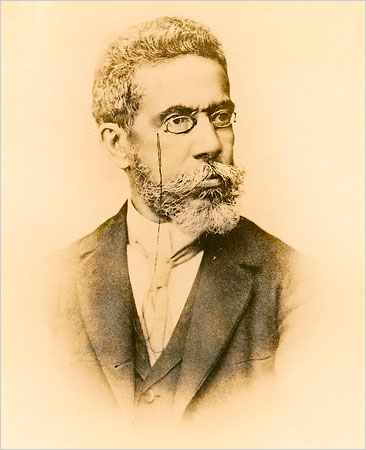

# Exercício 01 - HTML

Montar um pequeno site em html com um texto de Machado de Asis.

Abra o pdf chamado mact01.pdf. Nele, encontra-se um texto de Machado de Asis (http://machado.mec.gov.br/images/stories/pdf/critica/mact01.pdf). Leia e após ter uma ideia do que se trata o texto e como ele é organizado, faça:

1. Crie uma pasta com o nome machado-de-assis.
2. Dentro da pasta, crie um arquivo chamado index.html.
3. Copie o texto do pdf e construa uma página html. Lembre-se de usar as tags corretas:
	* <html></html>
	* <head></head>
	* <body></body>
	* <h1></h1>
	* <h2></h2>
4. Descubra o que faz as seguintes tags:
	*  
	* <b></b>

5. Use a tag  para adicionar uma imagem ao site.
	1. copie a imagem machado.jpg para a pasta que você criou.
	2. coloque o código: 

6. Use a tag  para criar um hyperlink:
	1. crie um novo arquivo html chamado parte-1.html.
	2. dentro dele, recrie toda a estrutura padrão de uma página html.
	3. recorte a primeira parte do texto da página index e coloque na sua nova página.
	4. no arquivo chamado index.html, adicione a seguinte tag: 
		<a href="parte-1.html">Ir para o capítulo 01</a>.

	5. teste mudar a tag para: <a href="parte-1.html" target="_blank">Ir para o capítulo 01</a>.
	6. teste mudar a tag para: <a href="parte-1.html" target="_self">Ir para o capítulo 01</a>.
	7. faça o mesmo para cada uma das partes do texto.
	8. crie um link para a página original do texto.
	9. crie um link para a página da wikipedia do Machado de Asis.
	10. crie um link para uma página de uma livraria que venda um livro do machado de assim.
	11. teste colocar a tag  em volta de outros locais do texto.